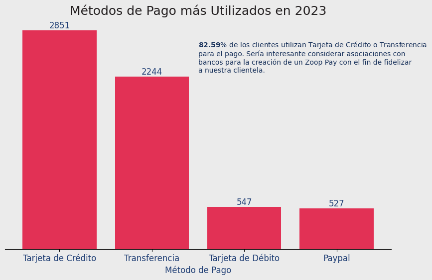
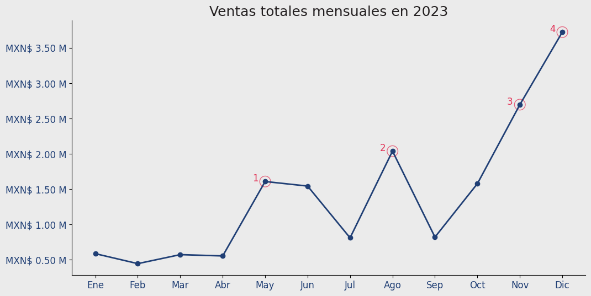
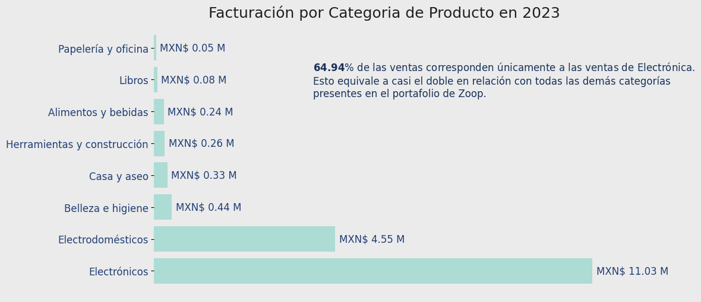
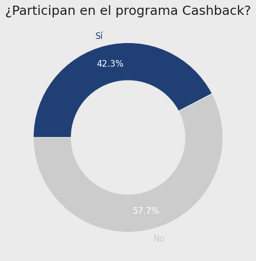
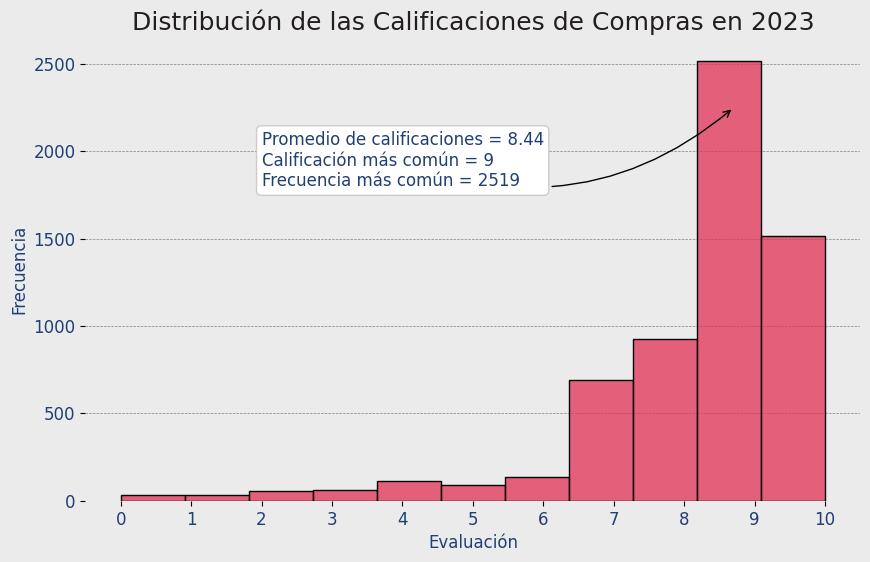
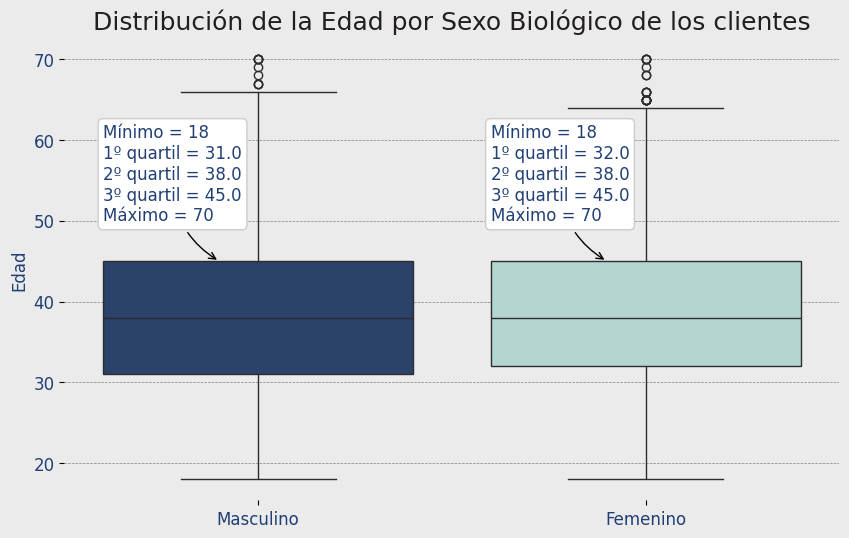

# 🧠 Proyecto ZOOP — IA aplicada a la Ciencia de Datos

Este proyecto fue desarrollado como parte del curso **"IA aplicada a la ciencia de datos: uso de la IA en la construcción de visualización de datos"**, con el objetivo de utilizar la inteligencia artificial como aliada en el análisis, diseño y comunicación visual de datos reales del negocio **Zoop**.

---

## 🎯 Objetivo

El propósito principal de este proyecto fue construir una narrativa visual coherente sobre el comportamiento de los clientes y ventas del año 2023 para la empresa ficticia **Zoop**, aplicando técnicas de análisis y visualización de datos con el respaldo de la inteligencia artificial para:

- Generación y refinamiento de visualizaciones.
- Elección de tipo de gráfico y estilo visual.
- Inclusión de insights mediante anotaciones y formatos.
- Estética uniforme basada en la **identidad visual de Zoop**.

---

## 📊 Visualizaciones Generadas

### 1️⃣ Métodos de Pago más Utilizados en 2023
Muestra los métodos de pago preferidos por los clientes y sugiere estrategias de fidelización.



---

### 2️⃣ Ventas Totales Mensuales en 2023
Se visualiza la estacionalidad de ventas, destacando los cuatro meses con mayor volumen.



---

### 3️⃣ Facturación por Categoría de Producto en 2023
Identifica qué tipo de productos generan mayor ingreso, destacando el dominio de Electrónica.



---

### 4️⃣ ¿Participan en el programa de Cashback?
Representa la proporción de usuarios que participan en el programa de fidelidad.



---

### 5️⃣ Distribución de las Evaluaciones de Compras en 2023
Muestra cómo evalúan los clientes sus compras, destacando promedio y moda.



---

### 6️⃣ Distribución de la Edad por Sexo Biológico de los Clientes
Compara edades según el sexo biológico con anotaciones automáticas sobre métricas clave.



---

## 🧪 Herramientas y Bibliotecas Utilizadas

- **Python**
- **Pandas** para manipulación de datos.
- **Matplotlib** y **Seaborn** para visualización.
- **Jupyter Notebook** como entorno de desarrollo.
- **IA (ChatGPT)** para generar código, refinar gráficos y aportar ideas analíticas.

---

## 📁 Estructura del Repositorio

```
├── img/                         <- Imágenes generadas del proyecto (.png)
├── IA_aplicada_a_ciencia...ipynb <- Notebook con todo el análisis
├── README.md                    <- Este archivo
```

---

## 🚀 Resultados

Este proyecto muestra cómo la IA puede asistir a un analista en todas las etapas de creación de visualizaciones: desde el diseño, elección de colores y estilos, hasta la automatización de análisis y creación de insights.

Gracias a estas herramientas, es posible construir informes visuales impactantes y profesionales en muy poco tiempo.

---

## 👤 Autor

**Eros Diaz**  
Estudiante del programa Oracle Next Education | Curso: *IA aplicada a la Ciencia de Datos*  
[GitHub del Proyecto](https://github.com/ErosAlexander/Proyecto-ZOOP---IA-aplicada-a-Data-Science)

---

